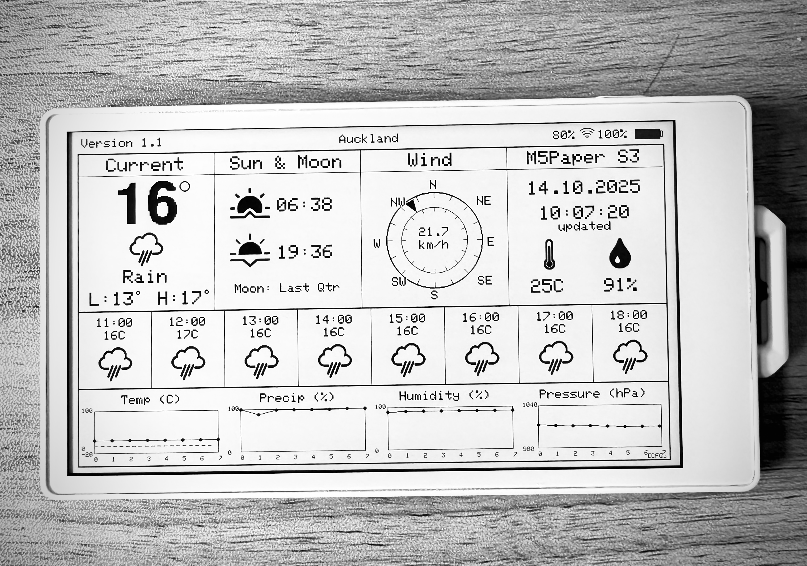

# PaperS3Weather



A comprehensive weather station for the M5Paper S3 e-ink display, featuring real-time weather data, 8-hour forecasts, and intelligent power management. Built with the M5Unified library and powered by the Open-Meteo API.

[](https://www.arduino.cc/)
[](https://platformio.org/)
[](https://www.espressif.com/)

## Features

- **Current Weather Conditions**: Large, easy-to-read temperature display with weather icons and conditions
- **8-Hour Forecast**: Hourly weather predictions with temperature and icons
- **Multiple Data Graphs**: Temperature, precipitation, humidity, and atmospheric pressure trends
- **Celsius/Fahrenheit Support**: Toggle between temperature units via configuration
- **City-Based Location**: Automatic coordinate lookup by city name
- **WiFi Configuration Portal**: Easy setup through web interface
- **Night Mode Power Saving**: Reduced refresh rate (10pm-5am) for extended battery life
- **Deep Sleep Implementation**: Efficient power management between updates
- **Sun & Moon Information**: Sunrise/sunset times and moon phase display
- **Wind Compass**: Real-time wind speed and direction visualization
- **Battery & WiFi Status**: Always-visible system information

## Hardware Requirements

- **M5Paper S3** device (4.7" e-ink display, 960x540 resolution)
- **USB-C cable** for programming and power
- **WiFi connection** for weather data

## Attribution

This project is based on [Bastelschlumpf's M5PaperWeather](https://github.com/Bastelschlumpf/M5PaperWeather), adapted for the M5Paper S3 hardware with significant modifications for the new platform.

### Key Changes from Original

- **Hardware Platform**: Migrated from M5Paper (EPD) to M5Paper S3 (S3-based)
- **Library Migration**: Switched from M5EPD to M5Unified library for M5Paper S3 compatibility
- **Weather API**: Replaced OpenWeatherMap with Open-Meteo API (no API key required)
- **Location System**: Added city-based geocoding with automatic coordinate lookup
- **Temperature Units**: Implemented Celsius/Fahrenheit toggle
- **Night Mode**: Configurable reduced refresh rate for battery efficiency
- **Display Design**: Redesigned Current Conditions panel with TrueType fonts
- **Power Management**: Enhanced deep sleep implementation
- **Configuration**: Web-based WiFi and settings configuration portal

## Quick Start

### For Beginners

#### 1. Install PlatformIO

If you're new to embedded development, PlatformIO is an excellent development environment:

1. Download and install [Visual Studio Code](https://code.visualstudio.com/)
2. Open VS Code and install the PlatformIO extension:
   - Click the Extensions icon (or press `Ctrl+Shift+X`)
   - Search for "PlatformIO IDE"
   - Click "Install"
3. Restart VS Code

#### 2. Clone or Download This Project

- **Option A**: Clone with git:
  ```bash
  git clone https://github.com/squirmen/PaperS3Weather.git
  cd PaperS3Weather
  ```

- **Option B**: Download ZIP:
  - Download the project as a ZIP file
  - Extract to a folder of your choice
  - Open the folder in VS Code

#### 3. Open Project in PlatformIO

1. Open VS Code
2. Click **File → Open Folder**
3. Select the `PaperS3Weather` folder
4. Wait for PlatformIO to initialize and download dependencies (first time only)

#### 4. Connect Your M5Paper S3

1. Connect your M5Paper S3 to your computer via USB-C cable
2. The device should be recognized automatically
3. Press the power button if the device doesn't turn on

#### 5. Build and Upload

1. In VS Code, look for the PlatformIO toolbar at the bottom
2. Click the **Build** button (checkmark icon) to compile
3. Once build succeeds, click the **Upload** button (arrow icon)
4. Wait for upload to complete (progress shown in terminal)

#### 6. Configure WiFi and Location

After first boot, the device will display a configuration screen:

1. **Connect to WiFi**:
   - On your phone/computer, look for WiFi network: `M5Paper-Weather`
   - Password: `configure`
   - Open browser and go to: `http://192.168.4.1`

2. **Enter Settings**:
   - **WiFi SSID**: Your home WiFi network name
   - **WiFi Password**: Your WiFi password
   - **City Name**: Your city (e.g., "Auckland", "New York", "Tokyo")
     - Just enter the city name, coordinates will be looked up automatically
     - Leave Latitude/Longitude fields blank unless you want manual coordinates
   - **Temperature Unit**: Choose Fahrenheit (default) or Celsius from dropdown
   - **Night Mode**: Leave checked (default) to enable reduced refresh rate 10pm-5am

3. **Save & Restart**:
   - Click "Save & Restart"
   - Device will restart and connect to your WiFi
   - Your city coordinates will be geocoded automatically (requires internet)
   - Weather data will be fetched and displayed

4. **Enjoy!**:
   - Weather dashboard will display and update automatically
   - Device sleeps between updates to save battery
   - Check serial monitor (`pio device monitor`) to verify city geocoding succeeded

### For Developers

Quick command-line workflow:

```bash
# Clone repository
git clone https://github.com/squirmen/PaperS3Weather.git
cd PaperS3Weather

# Build project
pio run

# Upload to device
pio run --target upload

# Monitor serial output
pio device monitor
```

## Configuration

### WiFi Configuration Portal

Access the configuration portal when:
- First boot (no WiFi configured)
- Connection fails to saved network
- You want to change settings

**Portal Details**:
- Network: `M5Paper-Weather`
- Password: `configure`
- URL: `http://192.168.4.1`

### Location Settings

Two methods to set location:

1. **City Name** (Recommended):
   - Enter your city name (e.g., "London", "Sydney", "New York")
   - Leave latitude/longitude fields blank
   - Coordinates are looked up automatically AFTER WiFi connection
   - Simpler and more user-friendly
   - Examples: "Tokyo", "Paris", "Auckland", "San Francisco"

2. **Manual Coordinates** (Advanced):
   - Enter exact latitude and longitude in decimal degrees
   - Useful for specific locations not found by city search
   - Format: Decimal degrees (e.g., -36.8485, 174.7633)
   - Overrides city name if provided

**How City Geocoding Works:**

The configuration portal runs in WiFi Access Point mode (no internet access), so city coordinates cannot be looked up during configuration. Instead:

1. Enter your city name in the config portal
2. Save settings and device restarts
3. Device connects to your WiFi (now has internet)
4. Coordinates are automatically geocoded from city name
5. Coordinates are saved for future use

This means you won't see geocoding errors in the config portal - they only occur after WiFi connection if the city name can't be found.

### Temperature Unit

Choose between Fahrenheit (default) or Celsius via dropdown menu in configuration portal. This affects all temperature displays including current conditions, forecasts, and graphs.

### Night Mode

**Enabled by default** via checkbox. When enabled, night mode reduces refresh frequency from 10 minutes to 60 minutes between 10pm and 5am, significantly extending battery life for overnight operation.

## Development

### Project Structure

```
PaperS3Weather/
├── src/
│   ├── main.cpp           # Main application code
│   └── Icons.h            # Weather icon bitmap data
├── platformio.ini         # PlatformIO configuration
├── README.md              # This file
└── LICENSE                # MIT License
```

### Customizing Refresh Intervals

Edit `src/main.cpp`:

```cpp
#define REFRESH_INTERVAL_DAY_MS 600000      // 10 minutes (default)
#define REFRESH_INTERVAL_NIGHT_MS 3600000   // 60 minutes (default)
```

Convert minutes to milliseconds: `minutes × 60 × 1000`

### Customizing Night Mode Hours

Edit `src/main.cpp`:

```cpp
#define NIGHT_START_HOUR 22  // 10pm (default)
#define NIGHT_END_HOUR 5     // 5am (default)
```

### Modifying Display Layout

The display uses Bastelschlumpf's panel-based layout:

- **Top Section**: 4 info panels (Current, Sun/Moon, Wind, Device)
- **Middle Section**: 8 hourly forecast columns
- **Bottom Section**: 4 data graphs

Panel positions are defined in `displayWeather()` function in `src/main.cpp`. Coordinates use absolute positioning for precise layout control.

### Adding Features

The code is modular and well-structured for extensions:

- **New weather data**: Modify `WeatherData` struct and `fetchWeatherData()`
- **Additional graphs**: Add new `drawGraph()` calls in `displayWeather()`
- **Custom panels**: Create new `draw*()` functions following existing patterns
- **Different APIs**: Replace Open-Meteo calls in `fetchWeatherData()`

## Troubleshooting

### Device Not Connecting to WiFi

**Problem**: Configuration portal doesn't appear or connection fails

**Solutions**:
- Ensure WiFi network is 2.4GHz (M5Paper S3 doesn't support 5GHz)
- Check WiFi password is correct (case-sensitive)
- Move device closer to router during initial setup
- Restart device by pressing power button

**Debug**:
```bash
pio device monitor --baud 115200
```
Watch serial output for connection errors.

### Display Not Updating

**Problem**: Weather display shows old data or "Failed to fetch weather"

**Solutions**:
- Verify internet connection is working
- Check serial monitor for API errors
- Confirm location coordinates are valid
- Open-Meteo API may be temporarily unavailable (retry in a few minutes)

**Manual Test**:
Visit in browser: `https://api.open-meteo.com/v1/forecast?latitude=40.7128&longitude=-74.0060&current=temperature_2m`
(Replace coordinates with your location)

### Upload Fails

**Problem**: PlatformIO can't upload to device

**Solutions**:
- Press and hold power button to ensure device is on
- Try different USB cable (some are charge-only)
- Try different USB port on computer
- Install/update USB drivers for your operating system
- Check device is recognized: `pio device list`

### Serial Monitor Shows Gibberish

**Problem**: Serial output is unreadable

**Solution**:
Ensure baud rate is 115200:
```bash
pio device monitor --baud 115200
```

### Battery Drains Quickly

**Problem**: Device battery doesn't last long

**Solutions**:
- Enable Night Mode in configuration
- Increase refresh intervals (edit main.cpp)
- Check deep sleep is working (serial monitor should show sleep messages)
- Verify WiFi signal is strong (weak signal increases power consumption)

### Configuration Portal Won't Open

**Problem**: Can't access `192.168.4.1`

**Solutions**:
- Ensure you're connected to `M5Paper-Weather` WiFi network
- Disable mobile data on phone (forces use of WiFi)
- Try `http://` explicitly: `http://192.168.4.1`
- Clear browser cache or try different browser
- Check device serial output for AP startup messages

### Weather Icons Not Displaying

**Problem**: Weather icons appear as blank squares

**Solution**:
- Icons.h may be corrupt - re-download project
- Check sufficient flash memory during build
- Verify `Icons.h` is in `src/` directory

### City Name Not Found / Geocoding Failed

**Problem**: Serial monitor shows "Geocoding failed" or "could not find city use lat long"

**Solutions**:
- Try city name without state/country (e.g., "Portland" not "Portland, Oregon")
- Try adding country (e.g., "Portland USA" or "Portland UK")
- Use major city nearby if your location is small
- Switch to manual coordinates as fallback
- Check internet connection is working (geocoding requires internet)

**How to see geocoding results**:
```bash
pio device monitor --baud 115200
```
Look for lines like:
```
Geocoding city: Tokyo
Found: Tokyo, Japan at 35.6895, 139.6917
```

**Manual Override**:
If geocoding consistently fails, enter manual coordinates in the config portal. You can find coordinates by:
1. Searching "[your city] coordinates" in Google
2. Using [latlong.net](https://www.latlong.net/)
3. Right-clicking location in Google Maps → "What's here?"

### Wrong Time Zone

**Problem**: Times displayed don't match local time

**Solution**:
Edit NTP timezone in `src/main.cpp` setup():
```cpp
configTime(timezone_offset_seconds, 0, "pool.ntp.org", "time.nist.gov");
```

Example offsets:
- GMT+0: `0`
- EST (GMT-5): `-5 * 3600`
- PST (GMT-8): `-8 * 3600`
- AEST (GMT+10): `10 * 3600`

Or use Open-Meteo's auto-timezone (default).

## API Information

This project uses the [Open-Meteo API](https://open-meteo.com/), a free weather API that requires no API key. The API provides:

- Current weather conditions
- Hourly forecasts
- Daily forecasts
- Sunrise/sunset times
- Multiple weather parameters

**API Limits**: Open-Meteo is free for non-commercial use with reasonable request limits. The default refresh interval (10 minutes) is well within limits.

## Power Consumption

**Typical Battery Life** (with 1150mAh battery):

- **Default Settings** (10min/60min refresh): ~7-10 days
- **Aggressive Mode** (5min refresh): ~3-5 days
- **Power Saver Mode** (30min/120min refresh): ~14-21 days

Deep sleep current draw: ~0.17mA
Active (fetching/displaying): ~150-200mA for 10-15 seconds

## License

MIT License

Copyright (c) 2025

Permission is hereby granted, free of charge, to any person obtaining a copy
of this software and associated documentation files (the "Software"), to deal
in the Software without restriction, including without limitation the rights
to use, copy, modify, merge, publish, distribute, sublicense, and/or sell
copies of the Software, and to permit persons to whom the Software is
furnished to do so, subject to the following conditions:

The above copyright notice and this permission notice shall be included in all
copies or substantial portions of the Software.

THE SOFTWARE IS PROVIDED "AS IS", WITHOUT WARRANTY OF ANY KIND, EXPRESS OR
IMPLIED, INCLUDING BUT NOT LIMITED TO THE WARRANTIES OF MERCHANTABILITY,
FITNESS FOR A PARTICULAR PURPOSE AND NONINFRINGEMENT. IN NO EVENT SHALL THE
AUTHORS OR COPYRIGHT HOLDERS BE LIABLE FOR ANY CLAIM, DAMAGES OR OTHER
LIABILITY, WHETHER IN AN ACTION OF CONTRACT, TORT OR OTHERWISE, ARISING FROM,
OUT OF OR IN CONNECTION WITH THE SOFTWARE OR THE USE OR OTHER DEALINGS IN THE
SOFTWARE.

## Acknowledgments

- **Original Design**: [Bastelschlumpf](https://github.com/Bastelschlumpf) for the excellent M5PaperWeather project
- **Weather Data**: [Open-Meteo](https://open-meteo.com/) for providing free, no-API-key weather data
- **Hardware**: [M5Stack](https://m5stack.com/) for the M5Paper S3 device and M5Unified library
- **Icons**: Weather icons from the original M5PaperWeather project

## Support

For issues, questions, or contributions:
- Open an issue on GitHub
- Check existing issues for similar problems
- Include serial monitor output for debugging

---

**Enjoy your PaperS3Weather station!**
